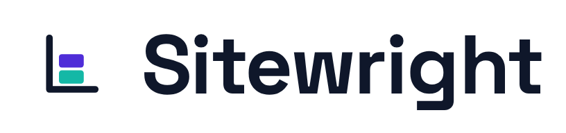

# Sitewright brand

The visual identity for **Sitewright** itself — the product. (This is separate from the
*per-project* brand tokens that agencies set for their clients' sites in
[`packages/schema/src/brand.ts`](../packages/schema/src/brand.ts).)

## The mark — "The Wright's Square"

A carpenter's square cradling two blocks set true to it.

> A **-wright** is a maker who works to a square — ship**wright**, play**wright**, wheel**wright**.
> The square is the tool of the trade; the two blocks are the modular site built true to it. One
> mark for *craft* (the square) and the *block editor* (the blocks).

Drawn on a 96×96 grid with a thin **7px** stroke, rounded caps/joins.

## Assets

| File | Use |
|------|-----|
| `assets/logo-mark.svg` | Primary mark (ink + indigo + teal) on light backgrounds |
| `assets/logo-mark-dark.svg` | Mark for dark backgrounds (white + lightened blocks) |
| `assets/logo-mark-mono.svg` | Single-colour mark — inherits CSS `color` via `currentColor` |
| `assets/logo-lockup-light.png` | Mark + wordmark, dark text — for light surfaces (README, docs) |
| `assets/logo-lockup-dark.png` | Mark + wordmark, white text — for dark surfaces |
| `assets/favicon.svg` | App-tile favicon (indigo tile, white mark) — contrast on any chrome |
| `assets/favicon-32.png`, `assets/favicon-16.png` | Raster favicon fallbacks |
| `assets/apple-touch-icon.png` | 180×180 iOS / PWA icon |
| `assets/brand-tokens.css` | Palette + type as CSS custom properties |
| `explorations/` | The full decision record (all 16 marks, weight & colour studies) |

> `assets/_render.html` is the build helper used to bake the Space Grotesk wordmark into the PNG
> lockups and rasterise the favicons; it is not shipped.

## Colour

| Token | Hex | Role |
|-------|-----|------|
| Ink | `#0F172A` | Wordmark, the square, body text |
| Indigo (primary) | `#4F2DD8` | Primary — matches the editor accent |
| Indigo light | `#6D5BF5` | Hover / on-dark primary |
| Teal (accent) | `#14B8A6` | Accent |
| Teal light | `#2DD4BF` | On-dark accent |
| Paper | `#F7F7FB` | Light background |

## Typography

- **Display / wordmark / headings:** **Space Grotesk** (700 for the wordmark, tracking `-0.02em`).
  A constructed grotesk that reads "built to a grid" — on-theme for a wright.
- **UI / body:** **Inter**.

Both are open-source and **self-hostable** — keep runtime off font CDNs, consistent with the
publish pipeline's typography rules. The wordmark always sets in Space Grotesk; for surfaces that
can't load the font (e.g. GitHub README text), use the PNG lockups above.

## Usage

- **Clear space:** keep at least the height of one block (≈ the mark's `rx`) around the lockup.
- **Minimum size:** mark ≥ 16px; below ~20px prefer `favicon.svg` (the tiled version) so the thin
  square stays legible.
- **Don't:** recolour the blocks arbitrarily, add effects/shadows, stretch, or set the wordmark in
  another typeface.
